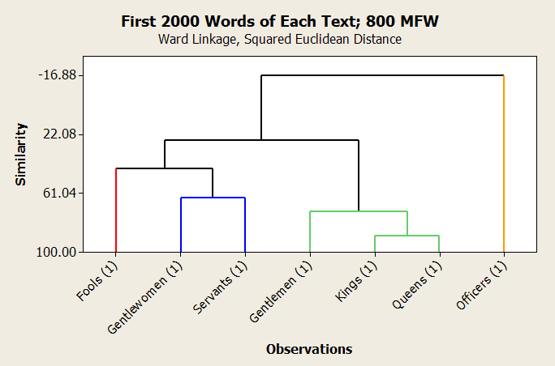
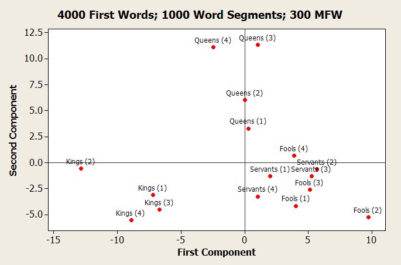
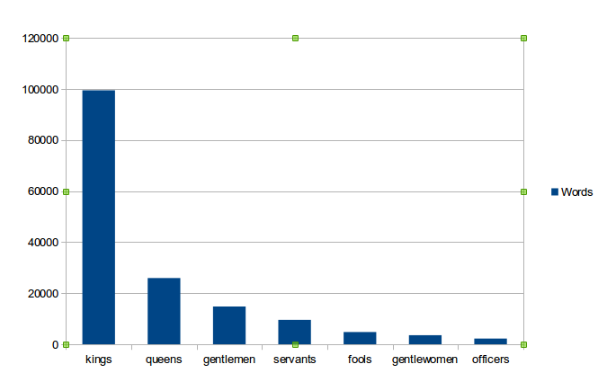
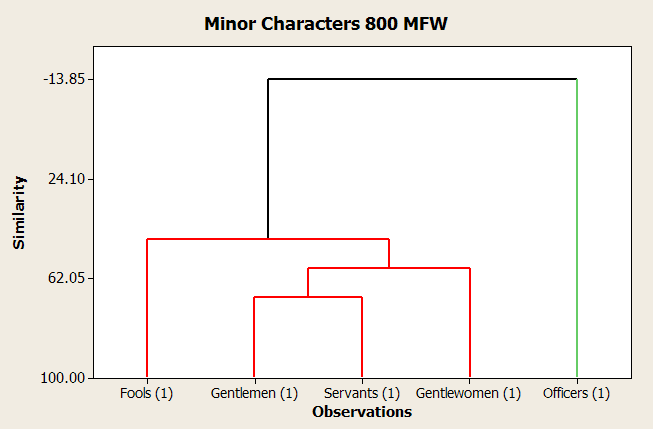
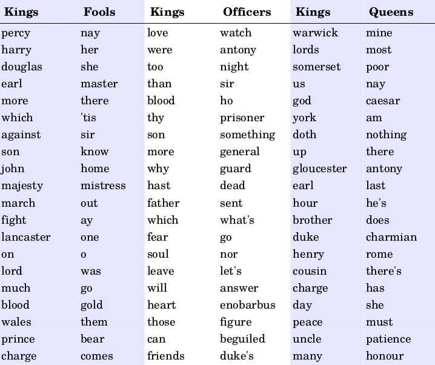

#“Imperial Voices”: 
| Gender and Social Class among Shakespeare's Characters, a Stylometric Approach 
| Jonathan Reeve

---

>“in the imitation of these twain—who as Ulysses says, opinion crowns with an imperial voice—many are infect.” —Nestor, Troilus and Cressida, Act 1, Scene 3.

#The Question
Can we quantify implicit class and gender hierarchies as represented in Shakespeare's plays? 

#Summary
 * categorized characters from Shakespeare's plays according to occupation and social class
 * extracted dialogue from those characters using TEI XML editions and Python scripting
 * performed statistical analyses on the resulting text to determine stylistic similarities between character categories 
 * identified distinctive language patterns among these categories

#Categorization of Characters
 * difficult problem, since this can be very subjective
 * who is considered a comic figure by one critic (or critical epoch) may be considered tragic by another
 * therefore, categories were chosen based on their descriptions in the casts of characters
 * categories chosen were "kings," "queens," "servants," "gentlemen," "gentlewomen," "officers," and "fools."

#Choosing the Characters
 * the [Shakespeare character search engine at the Electronic Literature Foundation](http://www.theplays.org/char.html) was used
 * some manual editing was necessary
 * there were many edge cases 
 * can Oberon, the king of the fairies, be considered a king for the purposes of this study?  

#Examples: 
 * Kings: Claudius (_Hamlet_), Lear, Oberon (_Midsummer_), the Henrys
 * Queens: Gertrude (_Hamlet_), Cleopatra, Titania (_Midsummer_) 
 * Gentlemen: Roderigo (_Othello_), Valentine (_Twelfth_), many called "a gentleman." 
 * Gentlewomen: Margaret (_Much Ado_), Helena (_All's Well_)
 * Servants: usually called "a servant" except for Launcelot, Leonardo, Balthasar, and Stefano in _Merchant_. 
 * [a full list here](appendices.pdf)

#Data Set
 * 42 plays in the Wordhoard Shakespeare Corpus
 * Unadorned XML
 * Note: I use this corpus uncritically, without really differentiating among those plays that are in question

#Folger Library XML
```xml
	<sp xml:id="sp-0006" who="#FRANCISCO-HAM">
		<speaker xml:id="spk-0006">
			<w xml:id="w0000570">FRANCISCO</w>
		</speaker>
		<ab xml:id="ab-0006">
		<lb xml:id="lb-00051"/>
			<join type="line" xml:id="ftln-0006" 
			n="1.1.6" ana="#verse" target="#w0000580 
			#c0000590 #w0000600 #c0000610 #w0000620 
			#c0000630 #w0000640 #c0000650 #w0000660 
			#c0000670 #w0000680 #c0000690 #w0000700 
			#p0000710"/>
			<w xml:id="w0000580" n="1.1.6">You</w>
			<c xml:id="c0000590" n="1.1.6"> </c>
			<w xml:id="w0000600" n="1.1.6">come</w>
			<c xml:id="c0000610" n="1.1.6"> </c>
			<w xml:id="w0000620" n="1.1.6">most</w>
			<c xml:id="c0000630" n="1.1.6"> </c>
			<w xml:id="w0000640" n="1.1.6">carefully</w>
			<c xml:id="c0000650" n="1.1.6"> </c>
			<w xml:id="w0000660" n="1.1.6">upon</w>
			<c xml:id="c0000670" n="1.1.6"> </c>
			<w xml:id="w0000680" n="1.1.6">your</w>
			<c xml:id="c0000690" n="1.1.6"> </c>
			<w xml:id="w0000700" n="1.1.6">hour</w>
			<pc xml:id="p0000710" n="1.1.6">.</pc>
		</ab>
	</sp>
```

#Wordhoard XML
```xml
    <sp who="Hamlet">
            <speaker>Hamlet</speaker>
            <l xml:id="sha-ham301055" n="55">
              To be, or not to be: that is the question:
            </l>
    </sp> 
```

#Dialogue Extraction
 * python script that uses the `ElementTree` library
 * key function: 
```python
for xml in xmls: 
 	for character in characters: 
		output+=xml.xpath('.//s:sp[@who="'+character+'"]/s:l/text()')
```
 * command-line program, built to be used in conjunction with Linux tools
```sh
echo 'Claudius, Lear, ... ' | parse.py *.xml > kings.txt
```

#Data Janitorial Tasks
 * tokenized with The Intelligent Archive
 * tokens grouped according to most frequent, given as percentage of total text

#Statistical Analysis
 * used principal component analysis (PCA) to find similarities among most frequently used words of each category
 * compresses high-dimensional data into two dimensions, showing statistically significant vectors
 * technique was pioneered by John Burrows and expanded upon by David Hoover

---

 

---

 

---

#Problem
 

--- 

##Problem
 * probability of a given word appearing in the "kings" category depends less on style than on the number of words

##Possible Solutions
 * remove categories with the largest and smallest numbers of characters
 * select chunks of text which represent the lowest common denominator, and randomize the selections

```bash
    for a in $(find . -name '-dialog.txt') ; 
    	do cat "$a" | sort -R > "$a.random" ; 
    done
```

---

 

---

 

---

#Distinctive Language Analysis
 * used David Hoover's Full Spectrum Spreadsheet
 * counts words that appear frequently in one category and seldom in another

---



#Kings vs. Fools
 * kings MDWs feature many proper names, including place names
 * fools MDWs have less concrete words
 * this suggests that fools are more likely to speak in abstractions
 * fool's song from King Lear: "Have more than thou showest, / Speak less than thou knowest" 

#Kings vs. Officers
 * most distinctive word for kings is "love," an unusual word for a soldier
 * related words include "heart" (#17), "sweet" (#21), "gentle" (#32)
 * kings use kinship terms: "son" (#7), "father" (#11), "cousin" (#43), "wife" (#70)
 * the order of the above is perhaps telling of a kinship hierarchy  

#Kings vs. Queens
 * kings no longer seem so sensitive in this comparison
 * kings feature hierarchical words: "lords" (#2), "Earl" (#10), "Duke" (#13) and militaristic words: "sword" (#23), "march" (#39), "war" (#47)
 * kings MDW kinship terms are all male: "brother" (#12), "uncle" (#20), "father" (#40)
 * kinship terms among the queens' MDWs are all female: "wife" (#23), "daughter" (#24), "woman" (#27)

#Gendered Pronouns
 * "she" and "her" don't appear in any of the kings' MDW lists
 * yet they appear high on MDW lists for fools (#4), servants (#9), and queens (#18)

---

Male royalty are predominantly concerned with other men, and female royalty are predominantly concerned with other women. 

#Non-surprise MDWs: 
 * fools: "ass" and "jest" 
 * officers: "watch," "prisoner" and "guard" 
 * kings: "crown" 

#Surprising MDWs
 * gentlewomen: "power" and "blood" 

#A Closer Look
 * a UNIX concordance: 
```bash
    grep power gentlewomen-dialog.txt > power.txt
    while read p  
      do grep -B 20  "$p" *.xml 
    done < power.txt
```
 * reveals that all uses of "power" and "blood" are from the passionate character Helena in _All's Well That Ends Well_

#Kings: They're Affirmative
"nay" appears high on the lists for fools, queens, servants, and gentlemen, yet doesn't appear at all in kings MDW lists. 

#Conclusions 
 * to some degree, statistical analysis of character language can reveal implicit class and gender hierarchies 

#Caveats
 * we cannot say whether these hierarchies are reflective of those hierarchies in Shakespeare's time, or in the times or places he represents
 * there are many complicating variables: 
   - corpus selection (some of the 42 Wordhoard corpus plays have disputed authorship)
   - casts of characters may not be accurate descriptors of the characters' true roles
   - relative text length greatly complicates this sort of text analysis

#Call for Contributions
 * all of the source code for this experiment is released under the GPLv3 and available [on my GitHub repository](https://github.com/JonathanReeve/shakespeare-dialog-extractor)
 * please add to it and improve it as you see fit

#Links
 * this presentation: [http://jonreeve.com/presentations/cbad](http://jonreeve.com/presentations/cbad)
 * the full paper, including lists of characters and lists of most distinctive words, can be found on: [http://jonreeve.com](http://jonreeve.com)
 * my email address: [jon.reeve@gmail.com](mailto:jonreeve@gmail.com)
