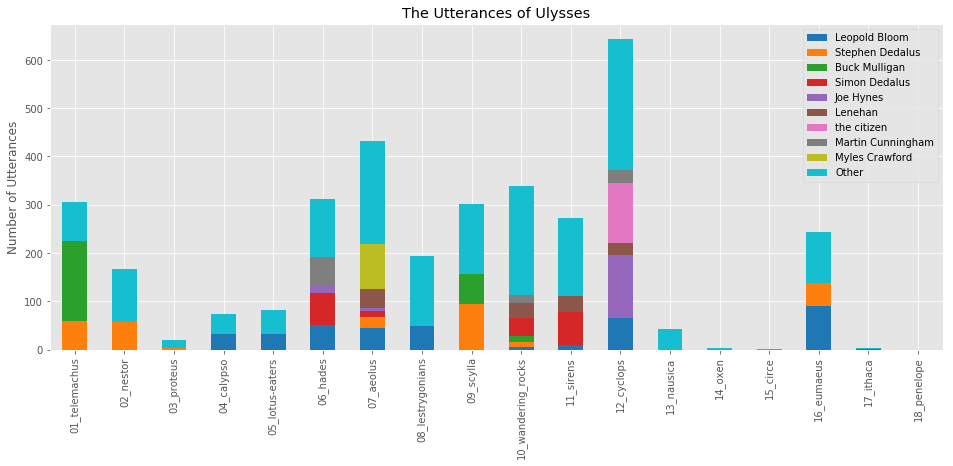
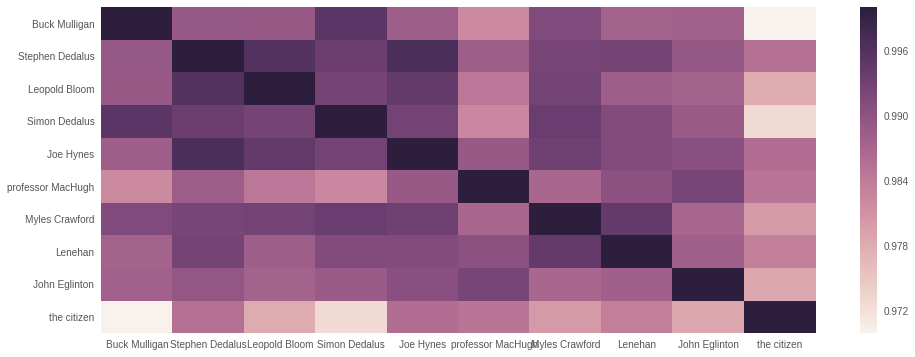
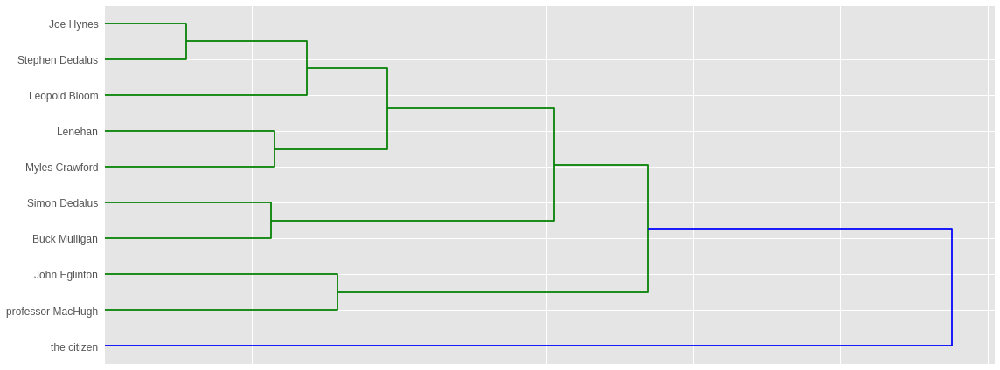
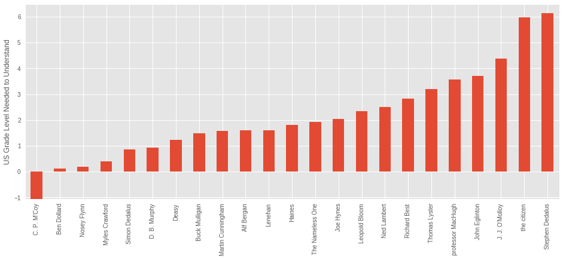
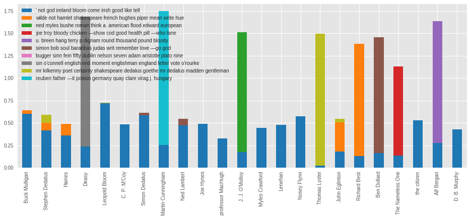

# Character Voice in James Joyce's _Ulysses_
| Jonathan Reeve
| Literary Modeling and Visualization Lab 
| Columbia University

---

# The Questions

 - How does Joyce distinguish his characters in _Ulysses_ through their speech? 
 - What do Joyce's characters talk about? What are their preoccupations?
 - Which of Joyce's characters are stylistically similar? Semantically?
   - What can a statistical analysis tell us that we don't already know?

# Defining "Speech"

 - Not thought or interior monologue
 - Anything with a dialogue dash 
 - Excludes alternate forms of dialogue in Circe, Ithaca, Penelope (for now)
 - (Sorry, Molly!)
 
# Mining Structured Data

 - Uses the open-source critical edition of _Ulysses_, written in TEI XML
 - TEI XML: Text Encoding Initiative eXtensible Markup Language

---

## Hard to computationally extract:

```
"He held the bowl aloft and intoned: 
—Introibo ad altare Dei." 
```

Who is "he"? 
Who is speaking?

---

## Easy to extract: 

```xml
He held the bowl aloft and intoned: 
<said who="Buck Mulligan">
  ―<quote xml:lang="la">Introibo ad altare Dei.</quote>
</said>
```

(This is from the open-source TEI XML edition.)

---

 

---

# Stylistic Analysis

 - TF/IDF of 500 most frequent words
 - Dimensionality reduction using Principal Component Analysis
 - Shows stylistic similarity
 
---


---

# Semantic Analysis

 - Uses Stanford GloVe word vectors (pre-trained word collocation models) 
 - Computes semantic document similarity using cosine similarity
 
---



---



---

# Most Distinguishing Words of Characters

 - Compute the distance, in standard deviations, from the mean of each word frequency, by character
 - Tabulate words more than 2.5 standard deviations from the mean frequencies

---

## Buck Mulligan
absurd, beastly, because, dedalus, etiquette, gentleman, jesuit, kinch, knows, mockery, mother, must, only, sea, thinks

## Stephen Dedalus 
black, brawn, dark, deasy, fear, from, mine, servant, sir, thank, three, understand

---

## Leopold Bloom
awfully, councillor, coy, excuse, fact, idea, just, keep, keyes, keys, metempsychosis, part, pussens, run, wants

## Simon Dedalus 
back, ben, blessed, child, christ, dick, died, glass, hold, little, looked, man, many, ned, poor, simple, stand, straight, whatever, wouldn

---

## Joe Hynes 
again, alf, ay, citizen, field, terry, truth

## Professor MacHugh 
fitzgibbon, heard, lord, loyal, shore, speech, taylor, words

--- 

## Myles Crawford
bite, bushe, forget, gallaher, gumley, in, mouth, murder, north, ohio, place, press, psha, right, time, took, twas, where

## John Eglinton 
believes, family, feel, genius, hamlet, has, hear, seven, shakespeare, shall, should, therefore, true

--- 

## The Citizen
fein, fish, flint, half, our, save

---

# Readability

 - Automated Readability Index (ARI)
 - US grade level needed to understand a character's speech. 
 - Calculates readability using characters per word and words per sentence.

---



---

# Topic Modeling

 - Uses non-negative matrix factorization (not LDA)
 - Term weighting with TF-IDF

---



--- 

# Links

 - This presentation: <http://jonreeve.com/presentations/ulysses-character-voice/>
 - The code: <https://github.com/open-editions/corpus-joyce-ulysses-tei/blob/master/analysis/character-speech.ipynb>
 - Literary Modeling and Visualization Lab: <http://xpmethod.plaintext.in/projects/literary-modeling.html>
 - My website: <http://jonreeve.com>
 - My email address: <jonathan.reeve@columbia.edu>
